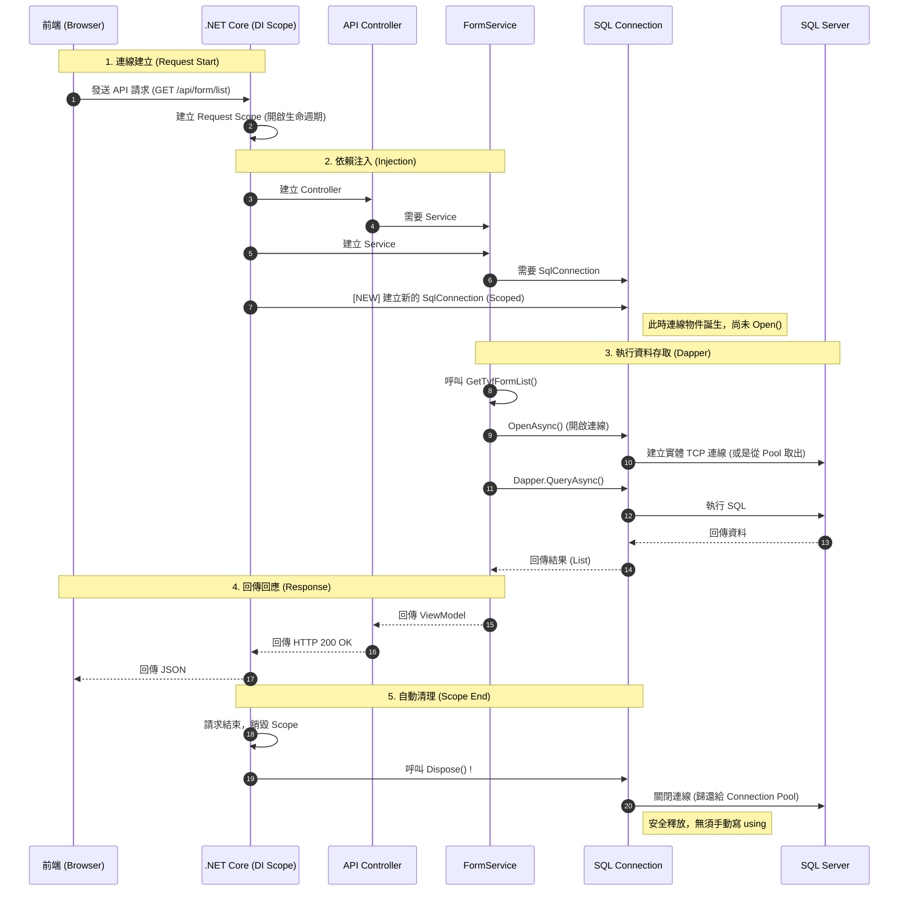

# Scoped DI 與 Dapper 連線生命週期詳解

這份文件解釋了為什麼使用 `.AddScoped<SqlConnection>` 搭配 Dapper 是安全且不會造成連線洩漏 (Connection Leak) 的。

## 1. 核心概念

### 什麼是 Scoped?
在 ASP.NET Core DI (Dependency Injection) 中，`Scoped` 代表 **「一次 HTTP 請求 (Request) 產生一個實體」**。
- 當前端發送 API 請求進來時，DI 容器會建立一個「範圍 (Scope)」。
- 在這個範圍內，第一次有人請求 `SqlConnection` 時，DI 會 `new` 一個新的出來。
- 在這個請求結束前，任何地方要求 `SqlConnection`，都會拿到 **同一個** 實體。
- **最重要的一點**：當 HTTP 請求結束（Response 回傳給前端）時，這個 Scope 會被銷毀，DI 容器會自動呼叫該 Scope 內所有物件的 `Dispose()` 方法。

### 什麼是 Dapper?
Dapper 是一個 **擴充套件 (Extension)**。
- 它不負責「建立」或「銷毀」連線。
- 它只負責「使用」你給它的連線去執行 SQL。
- 就像「工人 (Dapper)」與「工具箱 (Connection)」，工人用工具箱裡的工具做事，用完就放著，這工具箱何時要收起來，是「工頭 (DI/Scope)」負責的。

---

## 2. 請求處理流程圖 (Request Lifecycle)

## 3. 為什麼這樣是安全的？

### 不需要 `using` 的原因
通常我們寫程式需要用 `using (var conn = new SqlConnection()) { ... }` 來確保連線關閉。
但在 DI 注入的模式下，`Controller` 或 `Service` 的生命週期是由 DI 管理的。
- 你在 `Program.cs` 寫了 `builder.Services.AddScoped<SqlConnection, ...>`。
- 這告訴 DI 容器：「請幫我管好這個物件，請求結束時幫我殺掉它。」
- 所以你不需要在 Service 裡面手動寫 `conn.Dispose()` 或 `conn.Close()`，框架會在請求結束的那一瞬間（步驟 5）統一幫你做。

### Dapper 的角色
Dapper 的 `QueryAsync` 或 `ExecuteAsync` 方法，會在執行完 SQL 後，保持連線原本的狀態。
- 如果連線原本是關的，Dapper 會幫你開，執行完幫你關（這是 Dapper 的貼心設計）。
- 如果連線原本是開的（像你的程式中可能在 Transaction 前就開了），Dapper 用完會保持開啟，讓你可以繼續做下一次查詢。
- **最終防線**：不管中間發生什麼事（甚至報錯 Exception），只要 HTTP 請求結束，Layer 5 的 **Scope Dispose** 機制一定會啟動，強制把連線關掉。

## 4. 常見誤區
- **誤區**：「注入的連線會一直開著直到 App 關閉？」
    - **真相**：不會，因為是 `Scoped`，它只活在「單次 HTTP 請求」的幾毫秒/幾秒內。
    
- **誤區**：「如果我忘記 Close，連線池會爆嗎？」
    - **真相**：在 Scoped 模式下很難發生，因為框架幫你 Close 了。除非你在 singleton (單例) 服務裡注入了 Scoped 物件 (這通常編譯器或 runtime 會報錯警告 Captive Dependency)，否則都是安全的。

## 5. 總結
前端呼叫 API 到後端時：
1. **進來**：產生一個專屬的 Connection 物件。
2. **做事**：Service 用這個 Connection 透過 Dapper 拿資料。
3. **出去**：Response 回傳後，框架立刻把 Connection 丟進垃圾桶（呼叫 Dispose），連線自動歸還給 SQL Server 的 Connection Pool。

這就是現代 .NET Core 開發最標準且安全的寫法。
