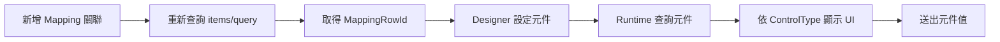

# Mapping Table 逐 SID 動態元件－前端串接指南

## 1. 文件目的

本文件說明前端如何串接 Multiple Mapping 的逐 SID 動態元件功能。

此功能將元件設定綁定至 Mapping Table 的單一資料列。API 不固定使用名為 `SID` 的欄位，而是依表單 Header 的 `MAPPING_PK_COLUMN` 取得 Mapping Row 的識別值，並統一以 `MappingRowId` 對外提供。

主要使用情境分為：

1. Designer：查詢 Mapping Rows，並替每個 `MappingRowId` 設定元件。
2. Runtime：依設定顯示元件，並將使用者輸入寫入 `TARGET_MAPPING_COLUMN_NAME`。

## 2. 部署前置條件

後端 API 啟用前，資料庫必須先執行：

```text
src/DcMateH5Api/docs/sql/20260720-multiple-mapping-component.sql
```

表單 Header 必須具備以下設定：

- `MAPPING_TABLE_NAME`
- `MAPPING_PK_COLUMN`
- `MAPPING_BASE_FK_COLUMN`
- `MAPPING_DETAIL_FK_COLUMN`
- `TARGET_MAPPING_COLUMN_NAME`

其中 `MAPPING_PK_COLUMN` 必須是 Mapping Table 的非 null 單欄主鍵或唯一欄位。

## 3. 重要契約規則

### 3.1 JSON 命名

API 使用 PascalCase，因此前端應讀取：

```ts
response.ComponentsByMappingRowId;
component.MappingRowId;
component.CurrentValue;
```

不要假設回傳欄位為 camelCase。

### 3.2 Enum 格式

`FormControlType` 使用數字：

```ts
export enum FormControlType {
  None = 0,
  Text = 1,
  Number = 2,
  Date = 3,
  Checkbox = 4,
  Textarea = 5,
  Dropdown = 6,
  DateTime = 7,
  Radio = 8,
}
```

`MappingListType`：

```ts
export enum MappingListType {
  All = 0,
  LinkedOnly = 1,
  UnlinkedOnly = 2,
}
```

### 3.3 MappingRowId 與 DetailPk

- `DetailPk`：Detail Table 的主鍵，也是既有 `Linked`／`Unlinked` Dictionary 的 key。
- `MappingRowId`：Mapping Table 的主鍵，也是 `ComponentsByMappingRowId` 的 key。

兩者不可混用。

```ts
const component = response.ComponentsByMappingRowId[mappingRowId];
const detailRow = response.Linked[component.DetailPk];
```

若 `MappingRowId` 可能包含 URL 特殊字元，呼叫路由前必須使用：

```ts
encodeURIComponent(mappingRowId);
```

## 4. 整體流程



尚未建立 Mapping Row 的 Unlinked 資料沒有 `MappingRowId`，因此必須先新增關聯，再進行元件設定。

## 5. 前端 TypeScript 型別

```ts
export interface MappingComponentOption {
  Value: string;
  Text: string;
  Order: number;
}

export interface RuntimeMappingComponent {
  MappingRowId: string;
  DetailPk: string;
  ControlType: FormControlType;
  CurrentValue: unknown;
  Options: MappingComponentOption[];
  IsConfigured: boolean;
}

export interface DesignerMappingComponent extends RuntimeMappingComponent {
  IsUseSql: boolean;
  DropdownSql: string | null;
}

export interface MappingComponentDesignerResponse {
  FormMasterId: string;
  TotalCount: number;
  ComponentsByMappingRowId: Record<string, DesignerMappingComponent>;
}

export interface MappingComponentUpsertRequest {
  ControlType: FormControlType;
  IsUseSql: boolean;
  DropdownSql: string | null;
  Options: MappingComponentOption[];
}

export interface MappingComponentValueUpdateRequest {
  Value: unknown;
}
```

## 6. Designer API

Designer API 的 Controller 基底路徑為：

```text
/Form/FormDesignerMultipleMapping
```

### 6.1 查詢 Mapping Rows 與元件設定

```http
POST /Form/FormDesignerMultipleMapping/{formMasterId}/mapping-components/query
Content-Type: application/json
```

Request：

```json
{
  "BaseId": "1001",
  "Page": 1,
  "PageSize": 20,
  "OrderBySeqAscending": true
}
```

規則：

- `BaseId` 必填。
- `Page` 與 `PageSize` 必須一起傳入或一起省略。
- 後端固定查詢 Linked Rows，因此 `Type` 可以省略。
- `DetailConditions`、`MappingConditions` 可沿用既有查詢條件契約。

Response 範例：

```json
{
  "FormMasterId": "9b31e6b1-5b3f-4ef2-beb0-63954e3d21aa",
  "TotalCount": 2,
  "ComponentsByMappingRowId": {
    "501": {
      "MappingRowId": "501",
      "DetailPk": "2001",
      "ControlType": 6,
      "CurrentValue": "A",
      "IsUseSql": false,
      "DropdownSql": null,
      "Options": [
        {
          "Value": "A",
          "Text": "啟用",
          "Order": 1
        },
        {
          "Value": "D",
          "Text": "停用",
          "Order": 2
        }
      ],
      "IsConfigured": true
    },
    "502": {
      "MappingRowId": "502",
      "DetailPk": "2002",
      "ControlType": 0,
      "CurrentValue": null,
      "IsUseSql": false,
      "DropdownSql": null,
      "Options": [],
      "IsConfigured": false
    }
  }
}
```

`IsConfigured=false` 表示 Mapping Row 已存在，但尚未設定可輸入元件。

### 6.2 設定一般輸入元件

```http
PUT /Form/FormDesignerMultipleMapping/{formMasterId}/mapping-components/{mappingRowId}
Content-Type: application/json
```

Text 範例：

```json
{
  "ControlType": 1,
  "IsUseSql": false,
  "DropdownSql": null,
  "Options": []
}
```

成功時回傳 `204 No Content`。

一般輸入元件不可傳入 Dropdown SQL 或 Options。

### 6.3 設定靜態 Dropdown 或 Radio

Dropdown：

```json
{
  "ControlType": 6,
  "IsUseSql": false,
  "DropdownSql": null,
  "Options": [
    {
      "Value": "A",
      "Text": "啟用",
      "Order": 1
    },
    {
      "Value": "D",
      "Text": "停用",
      "Order": 2
    }
  ]
}
```

Radio 使用相同契約，但 `ControlType` 改為 `8`。

靜態 Dropdown／Radio 至少需要一筆有效選項，且 `Value` 不可重複。

### 6.4 設定 SQL Dropdown 或 Radio

```json
{
  "ControlType": 6,
  "IsUseSql": true,
  "DropdownSql": "SELECT STATUS_CODE AS ID, STATUS_NAME AS NAME FROM ADM_STATUS",
  "Options": []
}
```

SQL 規則：

- 只能使用單一唯讀 `SELECT`。
- 不允許堆疊多段 SQL。
- 查詢結果必須包含 `ID` 與 `NAME` 欄位，欄位名稱不分大小寫。
- `ID`、`NAME` 不可為 null 或空字串。
- `ID` 不可重複。
- `ID` 必須可轉換成 `TARGET_MAPPING_COLUMN_NAME` 的 SQL 型別。
- 儲存時後端會同步選項快照；Runtime 不會重新即時執行 SQL。

### 6.5 清除元件設定

```http
DELETE /Form/FormDesignerMultipleMapping/{formMasterId}/mapping-components/{mappingRowId}
```

成功時回傳 `204 No Content`。

清除後 Mapping Row 仍然存在，但後續查詢會回傳：

```json
{
  "ControlType": 0,
  "Options": [],
  "IsConfigured": false
}
```

## 7. Runtime API

Runtime API 的 Controller 基底路徑為：

```text
/Form/FormMultipleMapping
```

### 7.1 查詢 Linked／Unlinked 與動態元件

```http
POST /Form/FormMultipleMapping/{formMasterId}/items/query
Content-Type: application/json
```

Request：

```json
{
  "BaseId": "1001",
  "Type": 0,
  "Page": 1,
  "PageSize": 20,
  "OrderBySeqAscending": true
}
```

Response 會保留既有的 `Linked`、`Unlinked`，並額外提供 `ComponentsByMappingRowId`：

```json
{
  "TargetMappingColumnName": "STATUS_CODE",
  "Linked": {
    "2001": {
      "MappingRowId": "501",
      "DetailPk": "2001",
      "MappingFields": {},
      "DetailFields": {}
    }
  },
  "Unlinked": {},
  "ComponentsByMappingRowId": {
    "501": {
      "MappingRowId": "501",
      "DetailPk": "2001",
      "ControlType": 6,
      "CurrentValue": "A",
      "Options": [
        {
          "Value": "A",
          "Text": "啟用",
          "Order": 1
        }
      ],
      "IsConfigured": true
    }
  }
}
```

`CurrentValue` 一律來自 Header 設定的 `TARGET_MAPPING_COLUMN_NAME`。

Unlinked 資料不會出現在 `ComponentsByMappingRowId`。

### 7.2 Runtime 元件顯示規則

```ts
export function resolveInputType(
  component: RuntimeMappingComponent,
): string {
  if (!component.IsConfigured) {
    return "none";
  }

  switch (component.ControlType) {
    case FormControlType.Text:
      return "text";
    case FormControlType.Number:
      return "number";
    case FormControlType.Date:
      return "date";
    case FormControlType.Checkbox:
      return "checkbox";
    case FormControlType.Textarea:
      return "textarea";
    case FormControlType.Dropdown:
      return "select";
    case FormControlType.DateTime:
      return "datetime-local";
    case FormControlType.Radio:
      return "radio";
    default:
      return "none";
  }
}
```

若符合下列任一條件，前端應保留資料列顯示，但不產生可輸入元件：

```ts
!component.IsConfigured ||
component.ControlType === FormControlType.None;
```

Dropdown／Radio 顯示 `option.Text`，送出時使用 `option.Value`。

### 7.3 更新單一 Mapping Row 的值

```http
PUT /Form/FormMultipleMapping/{formMasterId}/mapping-components/{mappingRowId}/value
Content-Type: application/json
```

Dropdown／Radio：

```json
{
  "Value": "A"
}
```

Text：

```json
{
  "Value": "使用者輸入的內容"
}
```

Number：

```json
{
  "Value": 123.45
}
```

Checkbox：

```json
{
  "Value": true
}
```

成功 Response：

```json
{
  "Affected": 1
}
```

Dropdown／Radio 必須送出 API 提供的 `Options[].Value`。不存在的選項、未設定元件或無法轉換成 SQL 欄位型別的值會收到 `400 Bad Request`。

### 7.4 Fetch 呼叫範例

```ts
export async function updateMappingComponentValue(
  formMasterId: string,
  mappingRowId: string,
  value: unknown,
): Promise<{ Affected: number }> {
  const encodedRowId = encodeURIComponent(mappingRowId);
  const response = await fetch(
    `/Form/FormMultipleMapping/${formMasterId}` +
      `/mapping-components/${encodedRowId}/value`,
    {
      method: "PUT",
      headers: {
        "Content-Type": "application/json",
      },
      body: JSON.stringify({ Value: value }),
    },
  );

  if (!response.ok) {
    throw new Error(await response.text());
  }

  return response.json() as Promise<{ Affected: number }>;
}
```

更新成功後，前端可以先同步更新本機的 `CurrentValue`，並視畫面需求重新查詢 `items/query`。

## 8. 新增關聯後設定元件

Unlinked Row 沒有 `MappingRowId`。前端新增關聯時應依序執行：

### 8.1 新增 Mapping 關聯

```http
POST /Form/FormMultipleMapping/{formMasterId}/items
Content-Type: application/json
```

```json
{
  "BaseId": "1001",
  "Items": [
    {
      "DetailId": "2003",
      "ExtraFields": {}
    }
  ]
}
```

成功時回傳 `204 No Content`。

### 8.2 重新取得 MappingRowId

再次呼叫：

```http
POST /Form/FormMultipleMapping/{formMasterId}/items/query
```

從新的 `Linked[detailPk].MappingRowId` 取得 Mapping Row 識別值。

### 8.3 Designer 設定元件

取得 `MappingRowId` 後，再呼叫 Designer 的元件設定 API。

新增關聯的初始狀態為：

```json
{
  "ControlType": 0,
  "Options": [],
  "IsConfigured": false
}
```

## 9. 移除關聯的影響

呼叫既有移除 Mapping API 時：

```http
POST /Form/FormMultipleMapping/{formMasterId}/items/remove
```

後端會在同一交易內：

1. 軟刪除該 Mapping Row 的元件選項。
2. 軟刪除該 Mapping Row 的元件設定。
3. 移除 Mapping Row。

移除後該設定不會再出現在查詢結果中。

## 10. 錯誤處理建議

前端至少應處理：

| HTTP 狀態 | 常見原因 | 建議處理 |
|---|---|---|
| `204` | Designer 設定或刪除成功 | 關閉編輯狀態並重新查詢 |
| `200` | 查詢或 Runtime 值更新成功 | 更新畫面資料 |
| `400` | 請求格式、選項、SQL 或型別驗證失敗 | 顯示 API 回傳訊息 |
| `404` | 表單或 Mapping Row 不存在 | 重新載入清單或提示資料已移除 |
| `409` | 有逐 SID 設定時變更 Mapping Table／PK／Target Column | 要求先清除逐 SID 設定 |

目前部分錯誤 Response 為純文字內容，前端不要假設所有錯誤都一定是 JSON `ProblemDetails`。

```ts
async function readApiError(response: Response): Promise<string> {
  const contentType = response.headers.get("content-type") ?? "";

  if (contentType.includes("application/json")) {
    const body = await response.json();
    return body.detail ?? body.title ?? JSON.stringify(body);
  }

  return response.text();
}
```

## 11. 前端驗收檢查清單

- [ ] API Response 使用 PascalCase 解析。
- [ ] `FormControlType` 依數字 enum 判斷。
- [ ] `Linked` 使用 `DetailPk` 作為 key。
- [ ] `ComponentsByMappingRowId` 使用 Mapping PK／SID 作為 key。
- [ ] `IsConfigured=false` 時不顯示可輸入元件。
- [ ] Dropdown／Radio 顯示 `Text`、送出 `Value`。
- [ ] 呼叫含 `MappingRowId` 的路由前使用 `encodeURIComponent`。
- [ ] 新增關聯後重新查詢，取得新產生的 `MappingRowId`。
- [ ] Runtime 更新只呼叫 `/mapping-components/{mappingRowId}/value`。
- [ ] 值更新成功後同步 `CurrentValue` 或重新查詢。
- [ ] 400、404、409 均顯示後端回傳訊息。

## 12. 後端契約位置

- `src/DcMateH5.Abstractions/Form/ViewModels/MultipleMappingComponentViewModels.cs`
- `src/DcMateH5.Abstractions/Form/ViewModels/MultipleMappingOperationViewModels.cs`
- `src/DcMateH5Api/Areas/Form/Controllers/FormDesignerMultipleMappingController.cs`
- `src/DcMateH5Api/Areas/Form/Controllers/FormMultipleMappingController.cs`
