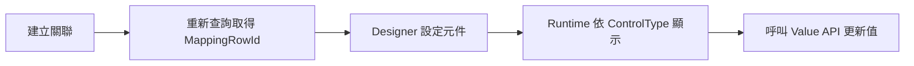

# Multiple Mapping 逐 SID 動態元件－前端串接手冊（白話版）

## 1. 這個功能在做什麼？

一句話說完：**Mapping Table 的每一筆資料，都可以有自己的輸入元件。**

例如同一張表裡：

- SID `501` 使用 Dropdown，值只能選 `A` 或 `D`。
- SID `502` 使用 Text，值由使用者自由輸入。

這裡說的 SID 不一定真的叫 `SID`。Header 的 `MAPPING_PK_COLUMN` 設哪一欄，後端就用那一欄的值當 `MappingRowId`。

每一筆可以有不同元件，但它們的值都寫到 Header 指定的同一個 Mapping Table 欄位，也就是 `MAPPING_COMPONENT_TARGET_COLUMN_NAME`。

最容易搞混的是下面兩個欄位：

| 欄位 | 現在是做什麼的 |
|---|---|
| `MAPPING_COMPONENT_TARGET_COLUMN_NAME` | 逐 SID 元件真正讀值、寫值的欄位 |
| `TARGET_MAPPING_COLUMN_NAME` | 舊功能繼續使用；逐 SID 元件不再看這個欄位 |

資料分工也很簡單：

| 設定位置 | 負責的事情 |
|---|---|
| `FORM_FIELD_MASTER.MAPPING_COMPONENT_TARGET_COLUMN_NAME` | 告訴後端元件值要放到 Mapping Table 哪一欄 |
| `FORM_FIELD_MULTIPLE_MAPPING_COMPONENT_CONFIG` | 記錄每個 `MappingRowId` 要顯示 Text、Dropdown、Radio 等哪一種元件 |
| `FORM_FIELD_MULTIPLE_MAPPING_COMPONENT_OPTION` | 記錄 Dropdown／Radio 可以選哪些值 |

所以 Config、Option 兩張表已經能支援「不同 SID 使用不同元件」；Header 新欄位只是補上「元件值到底要寫回 Mapping Table 哪一欄」。

## 2. 前端最短流程

### Designer 設定元件

1. 儲存 Header，設定 `MAPPING_COMPONENT_TARGET_COLUMN_NAME`。
2. 查詢已建立的 Mapping Rows。
3. 從查詢結果拿到 `MappingRowId`。
4. 替這個 `MappingRowId` 設定 Text、Dropdown、Radio 等元件。

### Runtime 顯示與更新

1. 呼叫 `items/query`。
2. 從 `ComponentsByMappingRowId` 找到每一筆要顯示的元件。
3. 只有 `IsConfigured=true` 才顯示輸入框。
4. 使用者改值後，呼叫 Value API；前端只要傳 `Value`。



## 3. 最重要的欄位

| 欄位 | 白話意思 | 前端怎麼用 |
|---|---|---|
| `BaseId` | Base Table 的主鍵值 | 指定要查看哪一筆主資料的關聯 |
| `DetailPk` | Detail Table 的主鍵值 | `Linked`／`Unlinked` Dictionary 的 key |
| `MappingRowId` | Mapping Table 的識別值，通常就是 SID | `ComponentsByMappingRowId` 的 key，也是設定及更新元件時使用的 ID |
| `IsConfigured` | 該 Mapping Row 是否已設定元件 | `false` 時不要顯示輸入元件 |
| `MappingComponentTargetColumnName` | 後端目前把元件值放在哪一欄 | 讓前端知道 `CurrentValue` 的來源；不用再傳回後端 |
| `CurrentValue` | 這一筆元件目前存的值 | 畫面一開始顯示的值 |
| `ControlType` | 要顯示的元件類型 | 決定前端要產生哪種 UI |
| `Options` | Dropdown／Radio 的有效選項 | 顯示 `Text`，送出 `Value` |

請特別注意：`DetailPk` 是明細資料 ID，`MappingRowId` 才是元件設定和更新值要用的 ID，兩個不能混用。

```ts
const linkedRow = response.Linked[detailPk];
const component = response.ComponentsByMappingRowId[linkedRow.MappingRowId];
```

Unlinked 資料還沒有 Mapping Row，所以也還沒有 `MappingRowId`。要先建立關聯、重新查詢，才可以替它設定元件。

## 4. API 一覽

| 用途 | Method | 路徑 |
|---|---|---|
| Designer 查詢元件設定 | `POST` | `/Form/FormDesignerMultipleMapping/{formMasterId}/mapping-components/query` |
| Designer 新增或覆寫元件 | `PUT` | `/Form/FormDesignerMultipleMapping/{formMasterId}/mapping-components/{mappingRowId}` |
| Designer 清除元件 | `DELETE` | `/Form/FormDesignerMultipleMapping/{formMasterId}/mapping-components/{mappingRowId}` |
| Runtime 查詢關聯與元件 | `POST` | `/Form/FormMultipleMapping/{formMasterId}/items/query` |
| Runtime 更新元件值 | `PUT` | `/Form/FormMultipleMapping/{formMasterId}/mapping-components/{mappingRowId}/value` |

路徑中的 `mappingRowId` 請先編碼：

```ts
const encodedMappingRowId = encodeURIComponent(mappingRowId);
```

## 5. Enum 與基本型別

API 使用數字 Enum，JSON 欄位名稱使用 PascalCase。

```ts
export enum FormControlType {
  None = 0,
  Text = 1,
  Number = 2,
  Date = 3,
  Checkbox = 4,
  Textarea = 5,
  Dropdown = 6,
  DateTime = 7,
  Radio = 8,
}

export enum MappingListType {
  All = 0,
  LinkedOnly = 1,
  UnlinkedOnly = 2,
}

export interface MappingComponentOption {
  Value: string;
  Text: string;
  Order: number;
}

export interface RuntimeMappingComponent {
  MappingRowId: string;
  DetailPk: string;
  ControlType: FormControlType;
  CurrentValue: unknown;
  Options: MappingComponentOption[];
  IsConfigured: boolean;
}
```

## 6. 查詢 Request 怎麼填？

Designer 查詢和 Runtime 查詢共用 `MappingListQuery`。

### 6.1 最簡單的 Designer 查詢

Designer 固定只查已關聯的 Mapping Rows，所以不用傳 `Type`：

```json
{
  "BaseId": "1001",
  "Page": 1,
  "PageSize": 20,
  "OrderBySeqAscending": true
}
```

### 6.2 最簡單的 Runtime 查詢

只需要顯示已關聯資料及元件時，使用 `LinkedOnly`：

```json
{
  "BaseId": "1001",
  "Type": 1,
  "Page": 1,
  "PageSize": 20,
  "OrderBySeqAscending": true
}
```

若畫面同時需要左右兩側的 Linked／Unlinked 清單，將 `Type` 改成 `0`。

規則：

- `BaseId` 必填。
- `Page`、`PageSize` 必須一起傳，或一起省略。
- `Page`、`PageSize` 必須大於 `0`。
- Runtime 的 `Type` 請明確傳入。

### 6.3 DetailConditions 與 MappingConditions

這兩個欄位只是「額外篩選條件」，不需要篩選時可以省略或傳空陣列。

| 欄位 | 查哪張表 | 例子 |
|---|---|---|
| `DetailConditions` | Detail Table | 用料號、名稱或狀態篩選明細資料 |
| `MappingConditions` | Mapping Table | 用 Mapping 的 SEQ、建立時間或其他欄位篩選已關聯資料 |

範例：Detail 的 `NAME` 包含「馬達」，且 Mapping 的 `SEQ` 大於等於 `10`：

```json
{
  "BaseId": "1001",
  "Type": 1,
  "DetailConditions": [
    {
      "Column": "NAME",
      "ConditionType": 2,
      "Value": "馬達"
    }
  ],
  "MappingConditions": [
    {
      "Column": "SEQ",
      "ConditionType": 5,
      "Value": "10"
    }
  ],
  "Page": 1,
  "PageSize": 20,
  "OrderBySeqAscending": true
}
```

常用的 `ConditionType`：

| 數值 | 意義 | 使用欄位 |
|---:|---|---|
| `1` | 等於 | `Value` |
| `2` | 包含／模糊查詢 | `Value` |
| `3` | 區間 | `Value`、`Value2` |
| `5` | 大於等於 | `Value` |
| `8` | IN | `Values` |
| `9` | 不等於 | `Value` |
| `10` | NOT IN | `Values` |
| `11` | IS NULL | 不用傳值 |
| `12` | IS NOT NULL | 不用傳值 |

注意：

- `Column` 必須是對應資料表的真實欄位名稱。
- 此 API 會從資料庫 Schema 取得型別，前端不需要自行判斷 `DataType`。
- Unlinked 資料沒有 Mapping Row，因此 `Type=2` 時不可傳 `MappingConditions`。

## 7. Designer：設定每筆 SID 的元件

後端會自己檢查目標欄位的資料型別。例如文字欄位可以用 Text，Dropdown 的選項也必須能存進該欄位；不合規則就回 `400`。

要取消元件設定時請呼叫 DELETE，不要用 PUT 傳入 `ControlType=0`。

建立元件前，先把 `MAPPING_COMPONENT_TARGET_COLUMN_NAME` 加進原本完整的 Header Request，再呼叫 `POST /Form/FormDesignerMultipleMapping/headers`。下面只列出和這個功能有關的部分，不是完整 Header Request：

```json
{
  "ID": "9b31e6b1-5b3f-4ef2-beb0-63954e3d21aa",
  "TARGET_MAPPING_COLUMN_NAME": null,
  "MAPPING_COMPONENT_TARGET_COLUMN_NAME": "STATUS_CODE"
}
```

這個欄位不是所有 Multiple Mapping 表單都必填。沒用逐 SID 元件時可以留空；要建立或更新逐 SID 元件時才一定要設定。

### 7.1 查詢目前設定

```http
POST /Form/FormDesignerMultipleMapping/{formMasterId}/mapping-components/query
Content-Type: application/json
```

Response 範例：

```json
{
  "FormMasterId": "9b31e6b1-5b3f-4ef2-beb0-63954e3d21aa",
  "MappingComponentTargetColumnName": "STATUS_CODE",
  "TotalCount": 2,
  "ComponentsByMappingRowId": {
    "501": {
      "MappingRowId": "501",
      "DetailPk": "2001",
      "ControlType": 6,
      "CurrentValue": "A",
      "IsUseSql": false,
      "DropdownSql": null,
      "Options": [
        { "Value": "A", "Text": "啟用", "Order": 1 },
        { "Value": "D", "Text": "停用", "Order": 2 }
      ],
      "IsConfigured": true
    },
    "502": {
      "MappingRowId": "502",
      "DetailPk": "2002",
      "ControlType": 0,
      "CurrentValue": null,
      "IsUseSql": false,
      "DropdownSql": null,
      "Options": [],
      "IsConfigured": false
    }
  }
}
```

### 7.2 設定 Text

```http
PUT /Form/FormDesignerMultipleMapping/{formMasterId}/mapping-components/{mappingRowId}
Content-Type: application/json
```

```json
{
  "ControlType": 1,
  "IsUseSql": false,
  "DropdownSql": null,
  "Options": []
}
```

### 7.3 設定靜態 Dropdown

```json
{
  "ControlType": 6,
  "IsUseSql": false,
  "DropdownSql": null,
  "Options": [
    { "Value": "A", "Text": "啟用", "Order": 1 },
    { "Value": "D", "Text": "停用", "Order": 2 }
  ]
}
```

Radio 使用相同格式，只要把 `ControlType` 改成 `8`。

### 7.4 設定 SQL Dropdown

```json
{
  "ControlType": 6,
  "IsUseSql": true,
  "DropdownSql": "SELECT STATUS_CODE AS ID, STATUS_NAME AS NAME FROM ADM_STATUS",
  "Options": []
}
```

SQL 必須符合以下規則：

- 只能有一個唯讀 `SELECT`。
- 結果必須包含 `ID`、`NAME` 欄位。
- `ID`、`NAME` 不可為 null 或空字串。
- `ID` 不可重複，而且必須能轉成 Target Column 的 SQL 型別。

儲存時，後端會執行 SQL 並保存選項快照。Runtime 查詢不會每次重新執行 Dropdown SQL。

### 7.5 設定成功與清除設定

新增、覆寫及刪除成功都回傳 `204 No Content`。

清除元件：

```http
DELETE /Form/FormDesignerMultipleMapping/{formMasterId}/mapping-components/{mappingRowId}
```

清除後 Mapping Row 還在，但會變成：

```json
{
  "ControlType": 0,
  "Options": [],
  "IsConfigured": false
}
```

## 8. Runtime：顯示與更新元件

### 8.1 查詢 Runtime 資料

```http
POST /Form/FormMultipleMapping/{formMasterId}/items/query
Content-Type: application/json
```

Response 會保留原本的 `Linked`、`Unlinked`，並加入 `ComponentsByMappingRowId`：

```json
{
  "TargetMappingColumnName": null,
  "MappingComponentTargetColumnName": "STATUS_CODE",
  "Linked": {
    "2001": {
      "MappingRowId": "501",
      "DetailPk": "2001",
      "MappingFields": {},
      "DetailFields": {}
    }
  },
  "Unlinked": {},
  "ComponentsByMappingRowId": {
    "501": {
      "MappingRowId": "501",
      "DetailPk": "2001",
      "ControlType": 6,
      "CurrentValue": "A",
      "Options": [
        { "Value": "A", "Text": "啟用", "Order": 1 },
        { "Value": "D", "Text": "停用", "Order": 2 }
      ],
      "IsConfigured": true
    }
  }
}
```

`MappingComponentTargetColumnName` 是後端順便告訴前端：「這批元件的值目前放在 Mapping Table 的哪一欄」。前端可以拿來檢查設定是否正確，但更新時不用把欄位名稱傳回去；Value API 只收 `Value`，真正要更新哪一欄由後端決定。

### 8.1.1 實際整合測試案例

下面不是假資料範例，而是 2026-07-21 實際拿開發資料庫跑過的結果：

| 項目 | 實測值 |
|---|---|
| `FormMasterId` | `837CAD09-413D-4D35-AAD2-3A865B233B54` |
| `BaseId` | `202601211451707` |
| `MappingRowId` | `156202957262999` |
| `MAPPING_COMPONENT_TARGET_COLUMN_NAME` | `DESC` |
| `ControlType` | `6`（Dropdown） |
| 有效選項 | `DEMO-A`、`DEMO-B` |

Runtime 查詢：

```http
POST /Form/FormMultipleMapping/837CAD09-413D-4D35-AAD2-3A865B233B54/items/query
Content-Type: application/json
```

```json
{
  "BaseId": "202601211451707",
  "Type": 1,
  "OrderBySeqAscending": true
}
```

實際回應的關鍵內容：

```json
{
  "MappingComponentTargetColumnName": "DESC",
  "ComponentsByMappingRowId": {
    "156202957262999": {
      "MappingRowId": "156202957262999",
      "ControlType": 6,
      "CurrentValue": "DEMO-A",
      "Options": [
        { "Value": "DEMO-A", "Text": "Demo option A", "Order": 1 },
        { "Value": "DEMO-B", "Text": "Demo option B", "Order": 2 }
      ],
      "IsConfigured": true
    }
  }
}
```

同一組條件呼叫 Designer 的 `mapping-components/query`，也確實會拿到 `MappingComponentTargetColumnName: "DESC"`。

接著真的呼叫 Value API，把值從 `DEMO-A` 改成 `DEMO-B`，再改回 `DEMO-A`。兩次更新都回傳 `Affected: 1`。測試結束後資料值和稽核欄位都已還原；Header 的 `MAPPING_COMPONENT_TARGET_COLUMN_NAME=DESC` 是正式設定，所以保留。

### 8.2 產生 UI

```ts
function getInputKind(component: RuntimeMappingComponent): string {
  if (!component.IsConfigured || component.ControlType === FormControlType.None) {
    return "none";
  }

  switch (component.ControlType) {
    case FormControlType.Text: return "text";
    case FormControlType.Number: return "number";
    case FormControlType.Date: return "date";
    case FormControlType.Checkbox: return "checkbox";
    case FormControlType.Textarea: return "textarea";
    case FormControlType.Dropdown: return "select";
    case FormControlType.DateTime: return "datetime-local";
    case FormControlType.Radio: return "radio";
    default: return "none";
  }
}
```

Dropdown／Radio：

- 畫面顯示 `Options[].Text`。
- 送出時使用 `Options[].Value`。
- 不要自行產生 Options 以外的值。

### 8.3 更新值

```http
PUT /Form/FormMultipleMapping/{formMasterId}/mapping-components/{mappingRowId}/value
Content-Type: application/json
```

```json
{
  "Value": "A"
}
```

成功時：

```json
{
  "Affected": 1
}
```

前端只要送 `Value`，後端會幫忙檢查：

- 該 `MappingRowId` 必須已設定元件。
- Dropdown／Radio 不接受 `null`。
- Dropdown／Radio 的值必須存在於有效 `Options`。
- 所有輸入都必須能轉成 `MAPPING_COMPONENT_TARGET_COLUMN_NAME` 對應欄位的 SQL 型別。

不要把欄位名稱塞進 Request，也不要自己猜要更新哪一欄。呼叫這支 Value API 並傳 `Value` 就可以。

既有的 `/mapping-table` API 仍可更新其他 Mapping 欄位；若用它更新 Target Column，也會套用相同的元件與選項驗證，不能用來繞過限制。

### 8.4 Fetch 範例

```ts
export async function updateMappingComponentValue(
  formMasterId: string,
  mappingRowId: string,
  value: unknown,
): Promise<{ Affected: number }> {
  const response = await fetch(
    `/Form/FormMultipleMapping/${formMasterId}` +
      `/mapping-components/${encodeURIComponent(mappingRowId)}/value`,
    {
      method: "PUT",
      headers: { "Content-Type": "application/json" },
      body: JSON.stringify({ Value: value }),
    },
  );

  if (!response.ok) {
    throw new Error(await readApiError(response));
  }

  return response.json();
}
```

## 9. 新增與移除關聯

### 新增關聯

Unlinked Row 沒有 `MappingRowId`，請依照以下順序：

1. 呼叫 `POST /Form/FormMultipleMapping/{formMasterId}/items` 建立關聯。
2. 重新呼叫 `items/query`。
3. 從 `Linked[detailPk].MappingRowId` 取得新產生的 Mapping Row ID。
4. 再呼叫 Designer API 設定元件。

剛建立的 Mapping Row 預設為 `IsConfigured=false`，Runtime 不應顯示可輸入元件。

### 移除關聯

呼叫：

```http
POST /Form/FormMultipleMapping/{formMasterId}/items/remove
```

後端會在同一交易中移除 Mapping Row，並軟刪除對應的元件及選項。前端成功後重新查詢即可。

## 10. 錯誤處理

| HTTP 狀態 | 意義 | 前端處理 |
|---|---|---|
| `200` | 查詢或 Runtime 更新成功 | 更新畫面資料 |
| `204` | Designer 設定、清除或關聯操作成功 | 重新查詢 |
| `400` | 請求、選項、SQL 或型別驗證失敗 | 顯示後端訊息，不更新本機值 |
| `404` | 表單或 Mapping Row 不存在 | 重新載入或提示資料已移除 |
| `409` | 還有逐 SID 設定，不能直接更換 Mapping Table、Mapping PK 或元件目標欄位 | 提示使用者先清除逐 SID 設定 |

部分錯誤是純文字，部分是 JSON。可使用：

```ts
async function readApiError(response: Response): Promise<string> {
  const contentType = response.headers.get("content-type") ?? "";

  if (contentType.includes("application/json")) {
    const body = await response.json();
    return body.detail ?? body.title ?? JSON.stringify(body);
  }

  return response.text();
}
```

## 11. 前端檢查清單

- [ ] 使用 PascalCase 讀取 API 欄位。
- [ ] `Linked`／`Unlinked` 使用 `DetailPk` 當 key。
- [ ] `ComponentsByMappingRowId` 使用 Mapping PK／SID 當 key。
- [ ] `IsConfigured=false` 時不顯示輸入元件。
- [ ] Dropdown／Radio 顯示 `Text`，送出 `Value`。
- [ ] 從查詢結果讀取 `MappingComponentTargetColumnName`，不要與舊的 `TargetMappingColumnName` 混用。
- [ ] Runtime 更新元件值時只傳 `Value`，並呼叫逐 SID Value API。
- [ ] `mappingRowId` 放入 URL 前使用 `encodeURIComponent`。
- [ ] 新增關聯後重新查詢，不能把 `DetailPk` 當成 `MappingRowId`。
- [ ] API 回 400 時保留原值並顯示訊息。

## 12. 後端部署提醒

如果環境從來沒有建立過逐 SID 元件資料表，執行：

```text
src/DcMateH5Api/docs/sql/20260720-multiple-mapping-component.sql
```

如果環境以前已經跑過 `20260720`，這次只要再執行：

```text
src/DcMateH5Api/docs/sql/20260721-multiple-mapping-component-target-column.sql
```

升級腳本會把「已經有逐 SID 元件設定」的表單，從舊欄位搬到新欄位。新欄位如果已經有值，不會被蓋掉。

設定資料表名稱：

- `FORM_FIELD_MULTIPLE_MAPPING_COMPONENT_CONFIG`
- `FORM_FIELD_MULTIPLE_MAPPING_COMPONENT_OPTION`

表單 Header 的基本必填設定：

- `MAPPING_TABLE_NAME`
- `MAPPING_PK_COLUMN`
- `MAPPING_BASE_FK_COLUMN`
- `MAPPING_DETAIL_FK_COLUMN`

逐 SID 元件另外使用：

- `MAPPING_COMPONENT_TARGET_COLUMN_NAME`：一般儲存 Header 時可留空；真的要用逐 SID 元件前必須設定。
- `TARGET_MAPPING_COLUMN_NAME`：保留給舊功能，逐 SID 元件不使用它。
